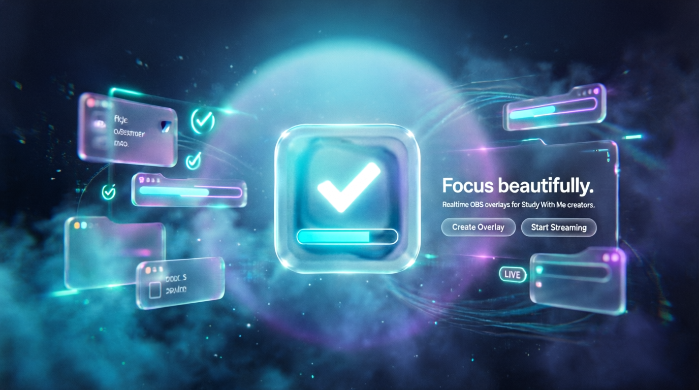

<center><h1>Study Overlay</h1></center>

> Real-time, futuristic OBS productivity overlays for Study With Me creators.

<p align="center">
  <a href="https://to-do-list-three-eta-84.vercel.app">Study Overlay website</a>
  
</p>

<p align="center">
  
  
  
  
  
</p>

---

# ✨ Overview

Study Overlay is a futuristic micro SaaS platform built for:

* 📚 Study With Me creators
* 🎥 Streamers
* 💻 Developers
* 🎯 Productivity enthusiasts
* 🧠 Deep work sessions

The platform allows users to:

* Create realtime task overlays
* Use overlays directly inside OBS
* Sync tasks instantly with Firebase
* Customize their productivity setup
* Create futuristic public profiles
* Add social links with automatic icon detection
* Build immersive study environments

---

# 🚀 Main Features

## 🔐 Authentication

* Google Authentication
* Persistent sessions
* Protected dashboard routes
* Firebase Authentication

---

## 🧩 OBS Overlay System

Realtime overlay page optimized for OBS Browser Source.

### Features

* Transparent background
* Realtime synchronization
* Glassmorphism UI
* LED borders
* Neon progress bars
* Smooth animations
* Lightweight rendering
* OBS optimized

Overlay route:

```txt
/overlay/:userId
```

---

## ✅ Task Management

Users can:

* Add tasks
* Complete tasks
* Delete tasks
* Track progress
* Sync tasks in realtime

---

## 👤 Profile System

Each user has:

* Avatar upload
* Bio
* Status system
* Social links
* Public identity
* Location
* Role / title

---

## 🌐 Smart Social Links

Features:

* Automatic social link detection
* Pixel art icons
* URL validation
* Security protection
* XSS prevention
* Manual icon override

Supported platforms:

* GitHub
* YouTube
* Discord
* Telegram
* Twitch
* LinkedIn
* TikTok
* Instagram
* X/Twitter
* WhatsApp
* Websites
* Portfolio links

---

## ⚡ Realtime Synchronization

Powered by Firebase Firestore.

Everything updates instantly:

* Tasks
* Overlay
* Profile
* Settings
* Progress

---

# 🎨 Design Philosophy

Study Overlay was heavily inspired by:


* Frutiger Aero
* Futuristic HUD interfaces
* OBS streaming overlays
* Modern SaaS dashboards

The visual identity focuses on:

* Glassmorphism
* Cyan neon glow
* Dark futuristic backgrounds
* HUD aesthetics
* Premium UI/UX
* Immersive productivity

---

# 🖼️ Screenshots

## Dashboard

<p align="center">


</p>

---

## OBS Overlay

<p align="center">
  

</p>

---

## Profile System

<p align="center">
   

</p>

---

# 🧠 Tech Stack
Apple VisionOS
## Frontend

* Vue 3
* Vite
* Tailwind CSS
* Vue Router
* Pinia

---

## Backend & Services

* Firebase Authentication
* Firestore Database
* Cloudinary

---

## UI / UX

* Glassmorphism
* Realtime UI
* LED animations
* Motion effects
* HUD-inspired interfaces

---

# 📂 Project Structure

```txt
src/
│
├── assets/
├── components/
├── composables/
├── constants/
├── router/
├── utils/
├── views/
├── lib/
├── App.vue
└── main.ts
```

---

# 🛠️ Installation

## Clone the repository

```bash
git clone https://github.com/YOUR_USERNAME/study-overlay.git
```

---

## Enter project folder

```bash
cd study-overlay
```

---

## Install dependencies

```bash
npm install
```

---

## Start development server

```bash
npm run dev
```

---

# 🔑 Environment Variables

Create a `.env` file.

```env
VITE_FIREBASE_API_KEY=
VITE_FIREBASE_AUTH_DOMAIN=
VITE_FIREBASE_PROJECT_ID=
VITE_FIREBASE_STORAGE_BUCKET=
VITE_FIREBASE_MESSAGING_SENDER_ID=
VITE_FIREBASE_APP_ID=

VITE_CLOUDINARY_CLOUD_NAME=
VITE_CLOUDINARY_UPLOAD_PRESET=
```

---

# 🔥 Firebase Structure

## Users

```txt
users/{uid}
```

---

## Tasks

```txt
users/{uid}/tasks/{taskId}
```

---

## Social Links

```txt
users/{uid}/socialLinks/{linkId}
```

---

## Overlay Settings

```txt
users/{uid}/settings/overlay
```

---

# 📺 OBS Setup

## Add Browser Source

Inside OBS:

1. Add Browser Source
2. Paste overlay URL
3. Set width and height
4. Enable transparency

Example:

```txt
https://your-domain.com/overlay/USER_ID
```

Recommended size:

```txt
400x700
```

---

# 🛡️ Security Features

Study Overlay includes:

* XSS protection
* URL validation
* Sanitized inputs
* Safe external links
* Protected Firebase routes
* Malicious protocol blocking

Blocked protocols:

```txt
javascript:
data:
file:
blob:
about:
chrome:
```

---

# 🎯 Performance Goals

The overlay was optimized for:

* OBS performance
* Lightweight rendering
* Smooth animations
* Low GPU usage
* Realtime updates
* Streaming environments

---

# 🌌 Visual Identity

## Main Colors

### Cyan

```css
#22D3EE
```

### Electric Blue

```css
#3B82F6
```

### Deep Navy

```css
#050816
```

---


# 🧪 Inspiration

Study Overlay was inspired by:


* Frutiger Aero
* Linear
* OBS overlays
* Modern productivity software

---

# 🧑‍💻 Developer

Built by:

## CAFÉ

* Full Stack Developer
* UI/UX Designer
* Study With Me, creator
* Productivity enthusiast

---

# 🌊 Philosophy

Study Overlay is not just a task manager.

It is about:

* Focus
* Atmosphere
* Consistency
* Immersion

The goal is to transform study sessions into immersive digital experiences.

---

# ⭐ Support

If you liked this project:

* Star the repository
* Share with friends
* Use it in your streams
* Fork and improve it

---

# 📜 License

MIT License.

---

# 🖤 Final Note

> "Focus beautifully."

<p align="center">
  
</p>
